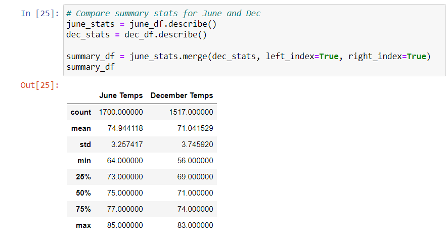
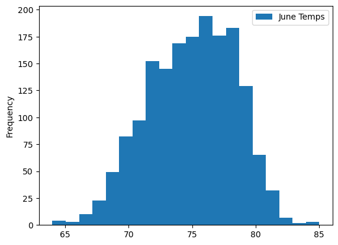
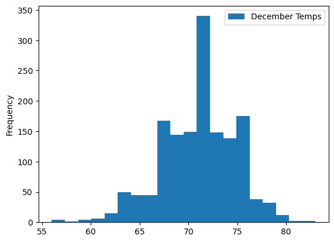
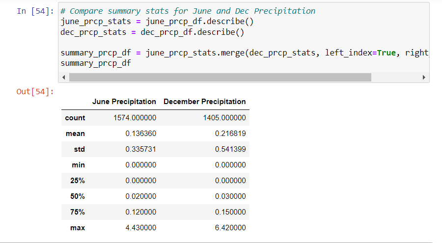

## Surf's Up Challenge

# Overview of the Analysis
The purpose of this analysis was to help an investor decide to open a surf and ice cream shop in Oahu, Hawaii. His main concern was whether or not the location on the island would be sustainable for the shop to stay open. In order to help W.Avy be prepared, we did an analysis of temperature trends on Oahu, Hawaii to determine if it is a good area to open up a Surf and Shake shop and be sustainable year-round. To analyze the weather data in Hawaii, SQLAlchemy was used to query the SQLite database and Flask was used to create an app, easily showing the investor and his board the weather data.

# Results

## Summary Statistics DataFrame: June vs. December Temperatures

## June Temperatures

## December Temperatures

There were a few key differences in weather in Oahu, Hawaii between the month of June and the month of December:
1. The mean temperature for June is higher than the mean temperature for December. 
2. June and December, both showed similar min, max and average temperatures.
3. The temperature does not have significant fluctuations throughout the year.

# Summary
In summary, the data supports opening a Surf and Shake shop that will be sustainable year-round. 
## Additional Queries
Additionally, if you look at precipitation levels in both June and December, you could see that the chances of continuous rainfall is low. This is helpful because although temperature is a big factor in whether or not many people would show up to the shop, precipitation could play a factor as well. 

- Summary Statistics: June vs. December Precipitation
